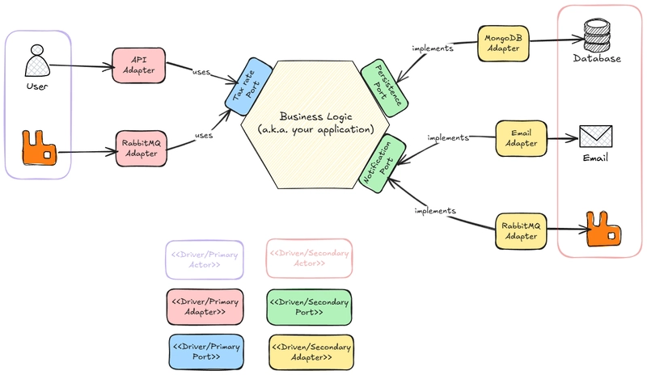
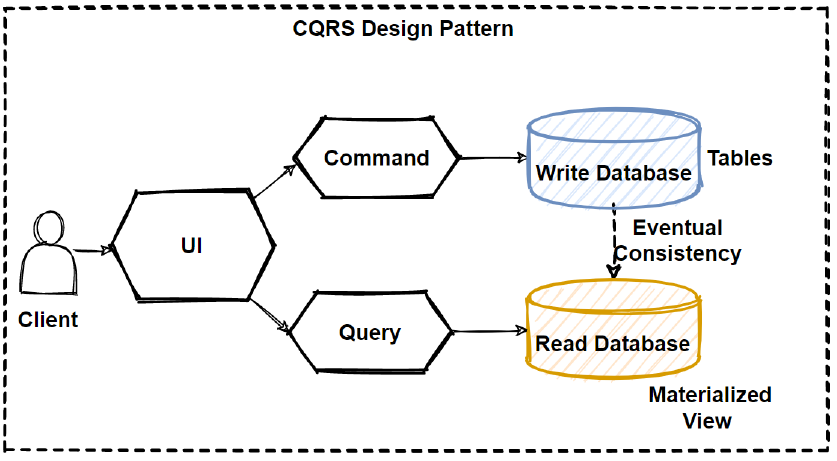
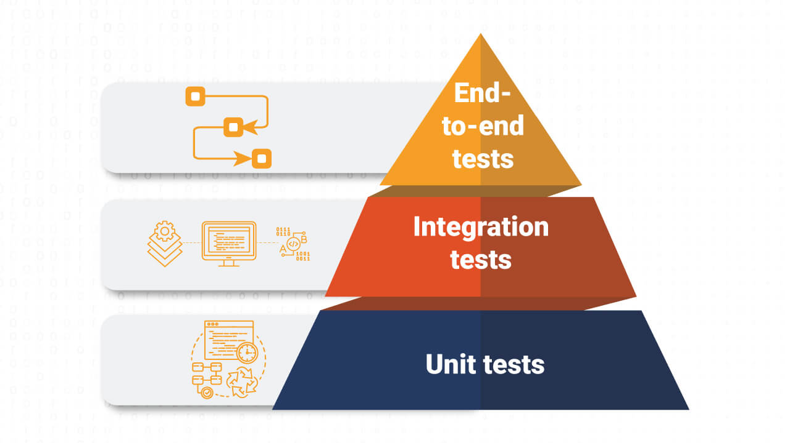

# CycleBike

## Sobre
CycleBike é uma aplicação Open Source para gerenciar alugueis de bicicletas elétricas!

Ela é dedicada para aprendizagem com:
- .NET 10
- Entity Framework Core
- MongoDB
- RabbitMQ
- Redis
- Docker
- Wolverine
- WebSocket - SignalR
- WebApi
- Workers Consumers
- CQRS
- Event Sourcing
- GraphQL
- Outbox Pattern
- Message Broker
- Microservices
- Hexagonal Architecture

## Arquitetura 
O projeto segue a arquitetura Hexagonal (Ports and Adapters).

Com Dominios Ricos, CQRS separado em Command e Query

- Utiliza o padrão de Event Sourcing para persistência de dados.
- Utiliza o padrão de Outbox Pattern para envio de mensagens a RabbitMQ e o padrão de Message Broker para recebimento de mensagens do RabbitMQ.
- Utiliza o padrão de Workers Consumers para processamento de mensagens do RabbitMQ.
- Utiliza o conceito de aplicação distribuida utilizando o padrão de Microservices.

## Testes
Utiliza xUnit para realizar a piramide de testes

## Funcionalidades Esperadas
- Cadastro de bicicletas
- Aluguel de bicicletas
- Devolução de bicicletas
- Consulta de bicicletas disponíveis
- Consulta de alugueis realizados
- Consulta de alugueis em andamento
- Consulta de alugueis finalizados
- Consulta de alugueis cancelados
- Consulta de alugueis por usuário
- Consulta de alugueis por bicicleta
- Consulta de alugueis por data
- Consulta de alugueis por status
- Consulta de bicicletas por status
- Consulta de bicicletas por localização
- Consulta de bicicletas por modelo
- Consulta de bicicletas por marca
- Cadastro de usuários
- Login de usuários
- Consulta de usuários
- Cadastro de Perfil
- Consulta de Perfil
- Pagamento de aluguel de bicicletas
- Envio de notificações para usuários
- Envio de notificações para administradores
- Envio de notificações para técnicos
- Registro de cupons
- Notificações de cupons